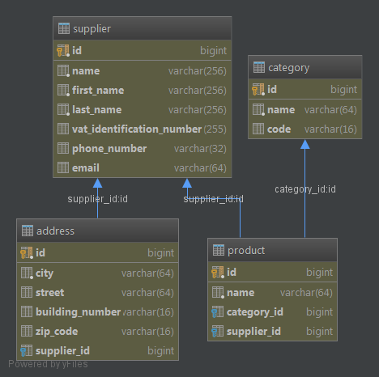

### Test database schema

### Run tests on the PostgreSQL local db

mvn clean test -Ppostgresql

### Run tests on the MS SqlServer local db

mvn clean test -Psqlserver

### Run tests on the MySQL local db

mvn clean test -Pmysql

---

Each profile activate specific database test groups and run specific Spring profile (in order use correct properties, see application-{profile}.yml files).

In order to create database specific test the test class should extend Abstract{Database}Test class. There is a correct test group declaration and spring profile activation.
